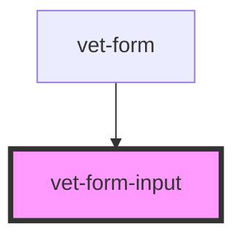

# vet-form-input

<!-- Auto Generated Below -->

## Properties

| Property     | Attribute     | Description | Type     | Default     |
| ------------ | ------------- | ----------- | -------- | ----------- |
| `element`    | `element`     |             | `string` | `undefined` |
| `errorMsg`   | `error-msg`   |             | `string` | `undefined` |
| `focused`    | `focused`     |             | `string` | `undefined` |
| `id`         | `id`          |             | `string` | `undefined` |
| `inputValue` | `input-value` |             | `string` | `undefined` |
| `maxChars`   | `max-chars`   |             | `number` | `undefined` |
| `minChars`   | `min-chars`   |             | `number` | `undefined` |
| `name`       | `name`        |             | `string` | `undefined` |
| `type`       | `type`        |             | `string` | `undefined` |

## Dependencies

### Used by

 - [vet-form](../vet-form)

### Graph

----------------------------------------------

*Built with [StencilJS](https://stenciljs.com/)*
